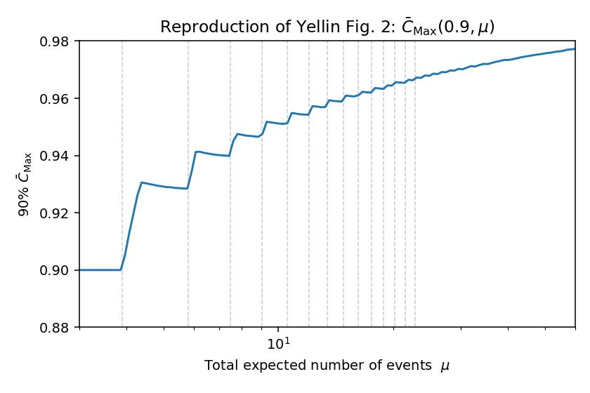

================
optimum_interval
================

|ci| |python| |license| |doi|

A small, tested Python implementation of **Yellin's optimum-interval method**
for setting frequentist upper limits in the presence of an unknown, non-
subtractable background — the technique used by direct-detection dark-matter
experiments (CDMS, XENON, LZ, …) to bound a signal cross section using only the
signal *shape*, with no background model and no binning.

Originally written by Jelle Aalbers and Christopher Tunnell at Nikhef (NL);
cleaned up, packaged, tested and documented here.

Method reference: S. Yellin, *"Finding an Upper Limit in the Presence of Unknown
Background"*, Phys. Rev. **D66** (2002) 032005,
`arXiv:physics/0203002 <https://arxiv.org/abs/physics/0203002>`_.

Learn it: ``TUTORIAL.md`` is a hands-on walkthrough; ``EXPLANATION.md`` is the
full physicist-oriented derivation and reimplement-it-yourself recipe.

Install
=======

.. code-block:: bash

   python -m venv .venv && source .venv/bin/activate
   pip install -e ".[dev]"

Not yet on PyPI (tracked in `#2 <https://github.com/tunnell/optimum_interval/issues/2>`_).

Quick start
===========

.. code-block:: python

   import numpy as np
   from optimum_interval import OptimumIntervalTable

   rng = np.random.default_rng(0)
   table = OptimumIntervalTable(rng=rng)

   # Observed events, already mapped to cumulant space (uniform [0, 1]) via the
   # signal CDF.  For raw energies, pass spectrum_cdf=your_normalized_cdf.
   events = np.sort(rng.random(8))

   mu_limit = table.upper_limit(events, confidence=0.9, n=2000)
   print("90% CL upper limit on mu:", mu_limit)

The analytic maximum-gap statistic (Yellin Eq. 2), which needs no Monte Carlo:

.. code-block:: python

   from optimum_interval import c0, x0
   c0(2.5, 5.0)     # P(max gap < 2.5 expected events | mu = 5)
   x0(0.9, 5.0)     # gap size at which C0 = 0.9

Reproducing the paper's figures
===============================

.. code-block:: bash

   python reproduce_figures.py --quick        # ~5 min, low statistics
   python reproduce_figures.py --full         # publication statistics (~2 h)
   python reproduce_figures.py --only compare # just Figs. 3 & 4 (the slow ones)

This regenerates **all five paper figures**, into ``figures/``:

* **Fig. 2** — :math:`\bar C_\mathrm{Max}(0.9,\mu)` vs :math:`\mu`.
* **Fig. 3** — median limit ratio :math:`\sigma_\mathrm{Med}/\sigma_\mathrm{True}`
  for :math:`C_0`, :math:`C_\mathrm{Max}`, :math:`p_\mathrm{Max}` and Poisson,
  with and without background.
* **Fig. 4** — fraction of "mistakes" (limit below the true value), test (b).
* **Fig. 5** — the :math:`p_\mathrm{Max}` variant, with its low-:math:`\mu` anchor.
* **C0 validation** — the :math:`k=0` Monte-Carlo max-gap distribution overlaid
  on the analytic :math:`C_0` (Eq. 2); a simulation-free correctness check.
* Two explanatory figures (Fig. 1 is a schematic) used by ``EXPLANATION.md``.

Each paper figure is also written side by side with the original, extracted
read-only from ``arXiv-physics0203002v2.tar.gz``. Figs. 3 & 4 run a large
experiment-comparison Monte Carlo and dominate the ``--full`` runtime.

Tests
=====

.. code-block:: bash

   pytest

The suite includes the key physics check that the Monte-Carlo maximum-gap
distribution reproduces the analytic :math:`C_0`.

Scope and related work
======================

This is a compact, readable reference implementation of Yellin's maximum-gap and
optimum-interval methods, focused on correctness, reproducibility, and pedagogy
(see ``EXPLANATION.md``). It is not a full direct-detection framework: for a real
analysis you supply the recoil-spectrum model — e.g. via
`wimprates <https://pypi.org/project/wimprates/>`_ (by a co-author here) — and
pass its CDF as ``spectrum_cdf`` (see ``TUTORIAL.md``). Yellin's original
routines and tables are at
`SLAC <http://www.slac.stanford.edu/~yellin/ULsoftware.html>`_.

Package layout
==============

::

   src/optimum_interval/      the library package
     intervals.py             pure interval geometry (k-largest, cumulants)
     analytic.py              analytic C0, x0, Poisson & max-gap limits
     montecarlo.py            OptimumIntervalTable + upper-limit solver
     comparison.py            ComparisonEngine for method comparison (Figs. 3-4)
     plotting.py              Fig. 2 helpers
   reproduce_figures.py       regenerate & verify every figure
   TUTORIAL.md                hands-on walkthrough
   EXPLANATION.md             the derivation / how-to-reimplement guide
   tests/                     pytest suite

.. |ci| image:: https://github.com/tunnell/optimum_interval/actions/workflows/ci.yml/badge.svg
   :target: https://github.com/tunnell/optimum_interval/actions/workflows/ci.yml
   :alt: CI status
.. |python| image:: https://img.shields.io/badge/python-3.10%2B-blue.svg
   :alt: Python 3.10+
.. |license| image:: https://img.shields.io/badge/license-BSD--3--Clause-blue.svg
   :target: https://github.com/tunnell/optimum_interval/blob/master/LICENSE
   :alt: BSD-3-Clause license
.. |doi| image:: https://zenodo.org/badge/DOI/10.5281/zenodo.21114720.svg
   :target: https://doi.org/10.5281/zenodo.21114720
   :alt: DOI
