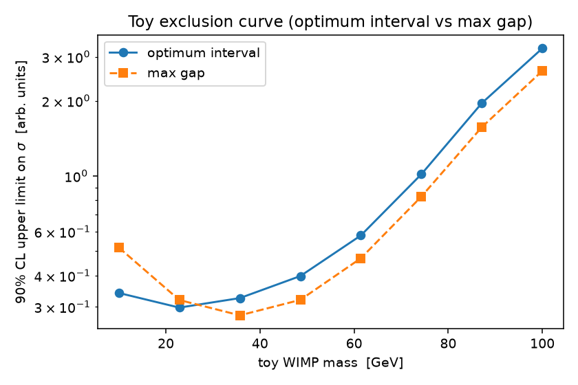

# Tutorial: from a spectrum to an exclusion curve

A hands-on walkthrough of the everyday workflow. For *why* the method works, see
[`EXPLANATION.md`](EXPLANATION.md); this file is about *how to use it*. Everything
here is in the runnable script [`examples/tutorial.py`](examples/tutorial.py):

```bash
python examples/tutorial.py
```

## Install

```bash
pip install optimum-interval
# or, for development:  pip install -e ".[dev]"
```

## The one-minute mental model

The method sets a frequentist upper limit on the expected number of signal
events `mu` (∝ cross section) using **only the shape of your signal**, with no
background model. It works in "cumulant space": you provide a **normalized**
signal CDF `spectrum_cdf` that maps your analysis window onto `[0, 1]`, and the
method looks for regions that are anomalously *empty* relative to the proposed
signal. That's it — you bring `dN/dE` (its shape) and your events; you get a
limit on `mu`.

## Step 1 — build a normalized `spectrum_cdf`

`spectrum_cdf` must be the cumulative of your signal shape, normalized so the
window maps onto exactly `[0, 1]`: `cdf(E_min) == 0`, `cdf(E_max) == 1`. **Do not
fold `mu` (the total count / cross section) into it** — `mu` is what you're
limiting; only the *shape* goes in the CDF. (`cumulant_points` will raise if the
CDF is unnormalized or non-monotonic.)

```python
import numpy as np

def exponential_spectrum_cdf(e0, e_min, e_max):
    """Normalized CDF for dN/dE ∝ exp(-E/e0) on [e_min, e_max]."""
    lo, norm = np.exp(-e_min / e0), np.exp(-e_min / e0) - np.exp(-e_max / e0)
    def cdf(E):
        E = np.clip(np.asarray(E, float), e_min, e_max)
        return (lo - np.exp(-E / e0)) / norm
    return cdf

cdf = exponential_spectrum_cdf(e0=8.0, e_min=1.0, e_max=40.0)
```

## Step 2 — the analytic max-gap limit (no Monte Carlo)

The maximum-gap statistic `C_0` has a closed form (Yellin Eq. 2), so this limit
needs no simulation. Transform your observed energies, take the largest gap, and
solve for `mu`:

```python
from optimum_interval import cumulant_points, max_gap_upper_limit

energies = np.array([2.1, 2.4, 3.0, 3.8, 5.2, 6.0, 22.0, 31.0])   # keV
max_gap_fraction = np.diff(cumulant_points(energies, cdf)).max()
mu_maxgap = max_gap_upper_limit(max_gap_fraction, confidence=0.9)
```

## Step 3 — the optimum-interval limit (Monte Carlo)

The optimum-interval statistic `C_max` uses intervals with a few events, not just
empty gaps, and is generally stronger. It needs a background-free Monte-Carlo
calibration, held on an `OptimumIntervalTable`:

```python
from optimum_interval import OptimumIntervalTable

table = OptimumIntervalTable(rng=np.random.default_rng(0))   # seed = reproducible
mu_optint = table.upper_limit(energies, confidence=0.9, spectrum_cdf=cdf, n=2000)
```

`n` is the number of Monte-Carlo trials per candidate `mu`; larger `n` gives a
less noisy limit. The table caches its work, so repeated calls are cheap.

## Step 4 — from `mu` to a cross-section / mass exclusion curve

For a fixed WIMP mass the counts scale linearly with cross section,
`mu = sigma * mu_1(M)`, so `sigma_UL(M) = mu_UL / mu_1(M)`. Sweep the mass,
rebuild `spectrum_cdf` for each (the shape hardens with mass), and **reuse the
same MC table** — the calibration lives in cumulant space and is
spectrum-independent:

```python
for M in masses:
    cdf_M = exponential_spectrum_cdf(e0_of_mass(M), 1.0, 40.0)
    mu_UL = table.upper_limit(energies, spectrum_cdf=cdf_M, n=2000)
    sigma_UL = mu_UL / counts_per_cross_section(M)   # your astrophysics here
```

Running `examples/tutorial.py` produces a toy exclusion curve:



(The astrophysics — `e0_of_mass`, `counts_per_cross_section` — is a deliberate
toy; a real analysis plugs in a package like `wimprates`. The *statistics* is
the real method.)

## Already in cumulant space?

If your events are already uniform on `[0, 1]` (e.g. you did the transform
yourself), just omit `spectrum_cdf` — it defaults to the identity:

```python
events = np.sort(np.random.default_rng(1).random(8))
mu_UL = table.upper_limit(events, confidence=0.9, n=2000)
```

## Tips

- **Reproducibility:** pass a seeded `np.random.default_rng(seed)` to
  `OptimumIntervalTable`; the whole pipeline is then deterministic.
- **Persistence:** `table.save("tables.p")` / `OptimumIntervalTable.load("tables.p")`
  to reuse an expensive calibration across sessions.
- **Max gap only:** for the simplest, MC-free limit use `max_gap_upper_limit`
  (or `c0` / `x0` directly).
- **Under the hood & validation:** `EXPLANATION.md` (derivation + reimplement
  recipe) and `python reproduce_figures.py` (reproduces all five paper figures).
