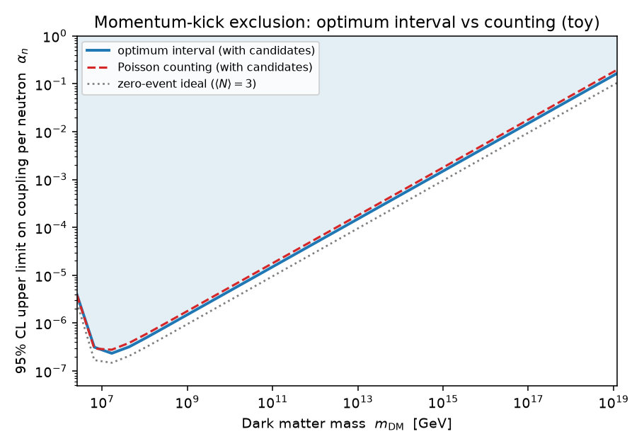

# Tutorial: momentum-kick searches (ultraheavy dark matter)

A dedicated walkthrough for impulse ("kick") searches with levitated sensors —
the ultraheavy-dark-matter (UHDM) setting where a single DM particle flying past
a levitated test mass delivers one measurable momentum transfer. The runnable
companion is [`examples/uhdm_momentum_kicks.py`](uhdm_momentum_kicks.py):

```bash
python examples/uhdm_momentum_kicks.py
```

For the generic method see [`TUTORIAL.md`](TUTORIAL.md); for the statistics,
[`EXPLANATION.md`](../EXPLANATION.md).

## The physics setting

An UHDM particle (say $m_\text{DM} \sim 10^6\text{–}10^{12}$ GeV) coupled to
neutron number through a long-range Yukawa force scatters off a levitated sensor
and imparts an impulse. Each candidate event has **one measured observable**:
the momentum transfer $q$, reconstructed from the sensor's ringdown. The
experiment counts kicks above a momentum threshold $q_\text{th}$ over a livetime
$T_\text{obs}$. (Public references for this class of search: Monteiro et al.,
[arXiv:2007.12067](https://arxiv.org/abs/2007.12067); Amaral et al.,
[arXiv:2409.03814](https://arxiv.org/abs/2409.03814).)

Three facts make this an optimum-interval problem:

1. **The signal shape in $q$ is known per mass.** For a massless mediator,
   integrating the classical Coulomb-like cross section over a
   Maxwell–Boltzmann halo gives

   $$\frac{dR}{dq} \propto \frac{1}{q^3}\left[e^{-(q/2\mu v_0)^2} -
   e^{-(v_\text{esc}/v_0)^2}\right],
   \qquad q \in [q_\text{th},\, 2\mu v_\text{esc}],$$

   with $\mu \simeq m_\text{DM}$ (the sensor is far heavier). Different masses
   predict different spectra and kinematic endpoints — exactly like WIMP recoil
   spectra vs WIMP mass.

2. **The normalization is the one unknown.** The rate scales as
   $(\alpha_n N_n)^2$ — the coupling per neutron squared, times the sensor's
   neutron number squared.

3. **The background is real but unmodelable.** Seismic/vibrational transients,
   cryostat events, and cosmic rays produce impulse-like candidates that pile up
   just above threshold, and none of them can be modeled to subtraction
   precision. This is the "unknown background" the optimum interval was
   invented for.

## Where the usual method breaks

The standard limit for these searches is: *"we observe zero events above
$q_\text{th}$, so we exclude any coupling predicting
$\langle N\rangle \gtrsim 3$"* (95% CL zero-event Poisson).

That is correct — it is the **zero-event special case of the optimum
interval**: with no events, the whole window is one gap, and the 95%
optimum-interval limit is $\mu_\text{UL} = -\ln 0.05 \simeq 3.0$ (the example
verifies this numerically). But the rule is brittle: the first candidate that
survives your cuts forces a bad choice —

- call it background (indefensible without a background model), or
- take the full Poisson multiplicity hit at *every* mass, or
- raise $q_\text{th}$ until zero events remain — a data-driven cut with an
  uncorrected trials factor, the very bias Yellin's paper opens with.

The optimum interval is the drop-in generalization: it uses the *emptiest*
stretch of the spectrum (chosen and calibrated correctly), so background
candidates clustered near threshold barely affect masses whose spectra extend to
high $q$.

## The workflow

Step by step from `examples/uhdm_momentum_kicks.py`:

**1. Signal shape → `spectrum_cdf`.** Integrate $dR/dq$ on a log grid and hand
the samples to `spectrum_cdf_from_samples`, which normalizes the window onto
$[0,1]$:

```python
def kick_spectrum_cdf(m_dm):
    q = np.geomspace(Q_TH, q_max(m_dm), 4000)
    pdf = drdq_alpha1(q, m_dm)
    cdf = np.concatenate([[0.0], np.cumsum(0.5 * (pdf[1:] + pdf[:-1]) * np.diff(q))])
    return spectrum_cdf_from_samples(q, cdf / cdf[-1])
```

**2. Per mass, keep only kinematically allowed candidates.** A kick with
$q > 2\mu v_\text{esc}$ cannot be signal for that mass, so it drops out of that
mass's analysis window:

```python
inside = KICKS[(KICKS > Q_TH) & (KICKS < q_max(m))]
```

**3. Limit on the expected count.** One Monte-Carlo calibration table serves
every mass (the calibration lives in cumulant space):

```python
table = OptimumIntervalTable(rng=np.random.default_rng(0))
mu_ul = table.upper_limit(inside, confidence=0.95,
                          spectrum_cdf=kick_spectrum_cdf(m), n=4000)
```

**4. Count → coupling.** Because the rate is *quadratic* in the coupling,
$N(\alpha_n) = (\alpha_n N_n)^2\, R(\alpha{=}1)\, T_\text{obs}$, the limit
inverts with a square root:

$$\alpha_n^\text{lim} = \frac{1}{N_n}
\sqrt{\frac{\mu_\text{UL}}{R(\alpha{=}1)\,T_\text{obs}}}.$$

A 2× stronger $\mu_\text{UL}$ is therefore $\sqrt2$ in the coupling.

## What the example shows

With five toy candidates — four transients just above an 8.4 TeV threshold plus
one outlier at 30 TeV (all fiducial numbers, not a real dataset):



- **High mass** (all candidates in-window): Poisson counting gives
  $\mu_\text{UL} = 10.5$; the optimum interval gives $\simeq 7.4$ by limiting
  from the empty stretch between the threshold cluster and the endpoint —
  ~20% stronger in $\alpha_n$, with no background model.
- **Near threshold** (narrow window, events fill it): the optimum interval
  $\approx$ Poisson, as it must — when the data look signal-like everywhere,
  there is no empty region to exploit and no method can do better.
- **The gray dotted curve** is the zero-event ideal ($\mu = 3$): reachable only
  if the detector stays perfectly quiet. The optimum interval is the principled
  way to get *close* to it when it doesn't.

## Caveats

- At 95% CL no coupling giving $\mu < 3.0$ can be excluded (the analog of
  Yellin's $\mu < 2.3$ floor at 90%) — the zero-event limit is already optimal.
- The optimum interval is conservative by construction: coverage is at least
  95%, never less, whatever the background.
- Finite mediator mass ($\lambda < \infty$) changes the *shape* $dR/dq$, and
  makes it depend on the coupling itself, so the single-solve `upper_limit`
  no longer applies directly. The worked notebook
  [`uhdm_finite_range.ipynb`](uhdm_finite_range.ipynb) handles that case by
  scanning the coupling and evaluating the extremeness with the package
  primitives at each grid point, for the seven planned mediator ranges
  $\lambda$ = 2 m down to 0.2 µm in decade steps (sensor radius
  $R_\text{eff}$ = 200 µm).
- Likewise the halo model: the example uses the simplified Maxwell–Boltzmann
  distribution (no Earth motion; $v_\text{esc}$ enters only as the integration
  cutoff). Upgrading to the full truncated, boosted distribution is again just a
  different $dR/dq$ fed to `spectrum_cdf_from_samples`.
- All experiment parameters in the example ($q_\text{th}$, $N_n$,
  $T_\text{obs}$, halo values) are illustrative fiducials — substitute your
  experiment's.
